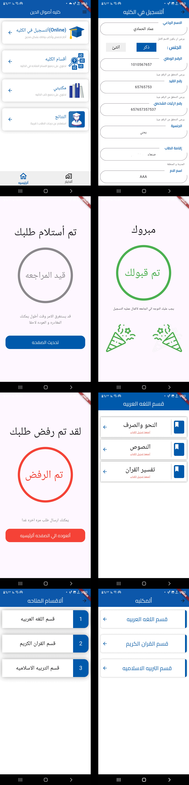
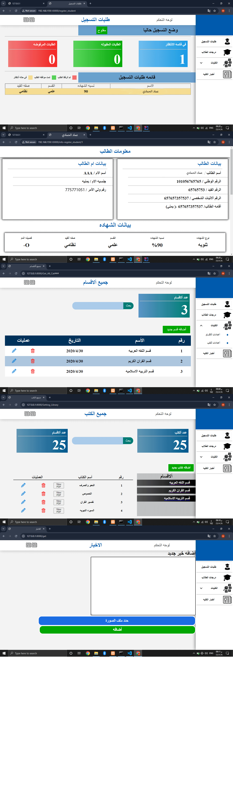

# Flutter-Project-For-Managing-Universities-And-Schools-For-Students
This is Mobile app

Web
<a href="https://github.com/Emad-Alhammadi-Github/Laravel-Project-For-Managing-Universities-And-Schools">repo web and Api</a>

I use for images
 
<a href="https://www.flaticon.com/free-icons/business-idea" title="business idea icons">Business idea icons created by Freepik - Flaticon</a>
